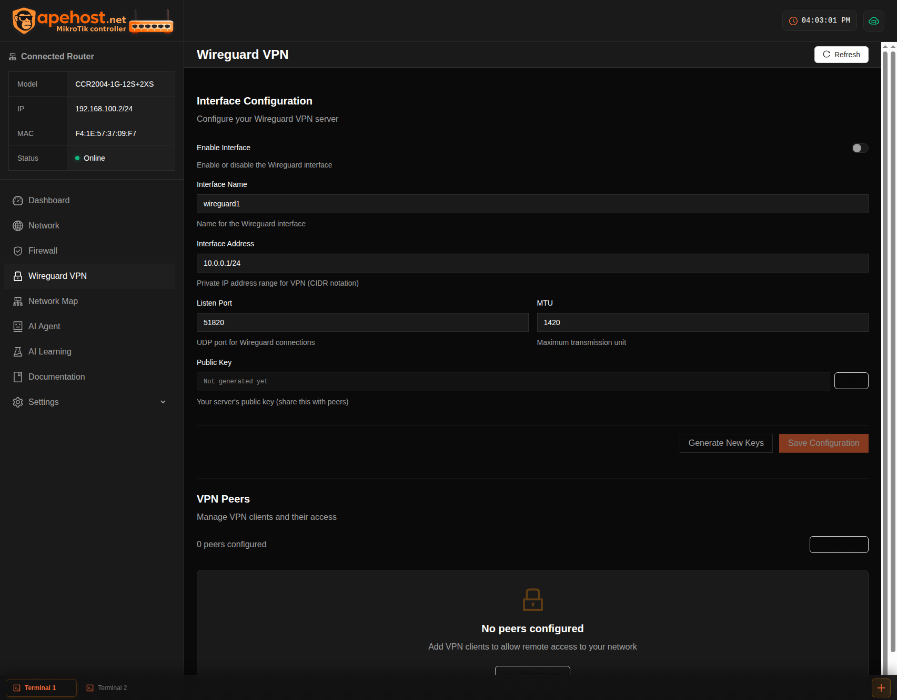
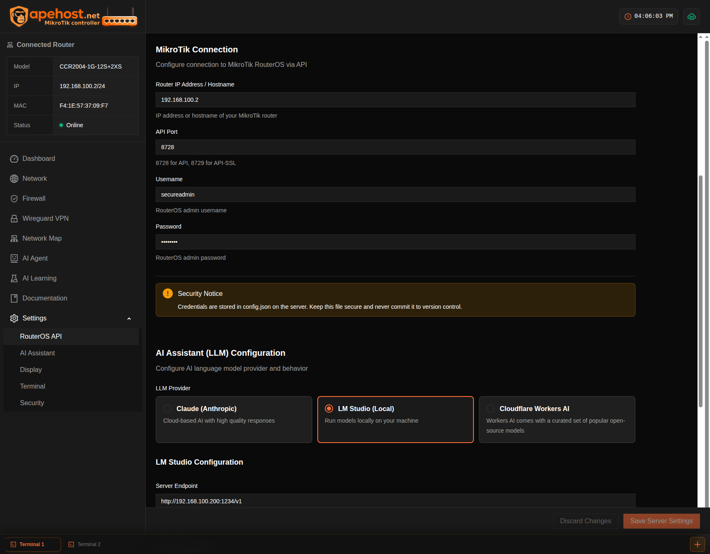

>

<div align="center">
  
</div>


> [!WARNING]
> **Work In Progress - Not Production Ready**
>
> This project is under active development and is **NOT ready for production use**. Features are incomplete, bugs are expected, and breaking changes may occur without notice. Use at your own risk.
>
> - Security features are not fully implemented
> - API stability is not guaranteed
> - Data loss may occur during updates
> - Not all features are fully functional

> [!NOTE]
> **Git History Cleaned - October 31, 2025**
>
> Database files were removed from git history. If you cloned this repository before October 31, 2025, please fetch the updated history:
> ```bash
> git fetch origin --force && git reset --hard origin/main
> ```
> See [SECURITY_INCIDENT_REPORT.md](SECURITY_INCIDENT_REPORT.md) for details.

Web-based management interface for MikroTik routers with AI-powered network diagnostics and troubleshooting capabilities.

## Interface Overview

The dashboard provides multiple specialized views for comprehensive network management:

### Dashboard
Real-time router metrics, system resource monitoring, interface status overview, and traffic statistics at a glance. Live WebSocket updates for interface data with visual traffic indicators.


### AI Agent Diagnostics
AI-powered network troubleshooting with automated issue detection, severity classification, confidence scoring, and actionable recommendations. Features 14 specialized MCP tools for deep network analysis including firewall path testing, connectivity diagnostics, and security auditing.


### Network Management
Comprehensive network management with tabbed interface for Interfaces, IP Addresses, Routes, and ARP Table. Features click-to-copy for all network values, toggle interfaces on/off, real-time traffic statistics, and detailed interface configuration.


### WireGuard VPN
Complete WireGuard VPN configuration with automatic key generation, peer management, QR code generation for mobile devices, and interface setup. Easy-to-use interface for secure remote access.



### Settings & Configuration
Comprehensive settings management with tabbed interface for Server Configuration and UI Preferences. Configure MikroTik connection, AI provider selection (Claude, Cloudflare Workers AI, LM Studio), system prompts, and application behavior.



## Quick Start

### Prerequisites
- Node.js 18+
- MikroTik router with API access enabled
- AI Provider (choose one):
  - **Claude** (Anthropic) - quality, highest cost
  - **Cloudflare Workers AI** - cheaper, function calling support, llama-4-scout-17b-16e model
  - **LM Studio** - Free local inference with custom models

### Frontend Setup
```bash
npm install
npm run dev       # Development server on port 5173
npm run build     # Production build
```

### Backend Setup
```bash
cd server
npm install
cp .env.example .env
# Configure .env with:
# - MikroTik router credentials
# - AI provider API key/endpoint
# - Server settings
npm run dev       # Backend server on port 3000
```

### Full Stack Development
```bash
npm run dev:full  # Runs frontend and backend concurrently with automatic port cleanup
```

## Tech Stack

**Frontend**
- React 18 + TypeScript 5
- CSS Modules with custom design tokens
- Vite 5 build system
- Atomic design architecture (atoms, molecules, organisms)
- Socket.IO client for real-time updates

**Backend**
- Node.js + Express + TypeScript
- MikroTik RouterOS API client (node-routeros)
- Multi-provider AI support with 14 MCP tools:
  - Claude AI SDK (Anthropic)
  - Cloudflare Workers AI (llama-4-scout-17b-16e-instruct)
  - LM Studio (local inference with OpenAI-compatible API)
- Socket.IO for real-time WebSocket updates
- Better-SQLite3 for local data persistence
- QR code generation for WireGuard mobile configs
- JSON-based configuration with file watcher and validation
- Zod schema validation

## AI Assistant Capabilities

**Diagnostic Tools**
- Firewall path analysis with exact blocking rule identification
- Connectivity testing (ping, traceroute) with quality metrics
- Network layer inspection (ARP, DNS, DHCP)
- Interface status and traffic analysis
- System resource monitoring
- Security vulnerability detection

**Troubleshooting Workflow**
1. Initial assessment and symptom collection
2. Layer-by-layer network analysis
3. Firewall rule path testing (80% of connectivity issues)
4. Interface and routing verification
5. Confidence-scored recommendations with severity classification

**Natural Language Interface**
- Plain English query support
- Automatic tool selection based on context
- Detailed technical explanations
- Actionable remediation steps
- Issue tracking with status management (Detected, Investigating, Resolved, Ignored)

See [server/MCP_TOOLS_QUICK_REFERENCE.md](server/MCP_TOOLS_QUICK_REFERENCE.md) for complete tool documentation.


## Configuration

### Environment Variables

**Frontend** (`.env`)
```
VITE_API_URL=http://localhost:3000
VITE_WS_URL=ws://localhost:3000
```

**Backend** (`server/.env`)
```
# Server
PORT=3000
NODE_ENV=development
CORS_ORIGIN=http://localhost:5173

# MikroTik Router
MIKROTIK_HOST=192.168.x.x
MIKROTIK_PORT=8728
MIKROTIK_USERNAME=admin
MIKROTIK_PASSWORD=your_password_here
MIKROTIK_TIMEOUT=10000
MIKROTIK_KEEPALIVE_SEC=30

# AI Provider (choose one: claude, cloudflare, or lmstudio)
LLM_PROVIDER=claude

# Claude AI - Premium quality, high cost
ANTHROPIC_API_KEY=sk-ant-...
CLAUDE_MODEL=claude-3-5-sonnet-20241022

# Cloudflare Workers AI - 93% cheaper, with function calling
CLOUDFLARE_ACCOUNT_ID=your_account_id
CLOUDFLARE_API_TOKEN=your_api_token
CLOUDFLARE_AI_MODEL=@cf/meta/llama-4-scout-17b-16e-instruct
# Optional: AI Gateway for caching/analytics
# CLOUDFLARE_AI_GATEWAY=my-gateway-name

# LM Studio - Free local inference
LMSTUDIO_ENDPOINT=http://localhost:1234/v1
LMSTUDIO_MODEL=your-model-name
LMSTUDIO_CONTEXT_WINDOW=32768

# Data Storage
DATA_DIR=./data
BACKUPS_DIR=./data/backups
```

**Development Commands**
```bash
# Frontend
npm run dev              # Start Vite dev server
npm run build            # Build for production
npm run preview          # Preview production build

# Backend
cd server
npm run dev              # Start with hot reload
npm run build            # Build TypeScript
npm run start            # Run production build
npm run typecheck        # Type checking only

# Configuration Management
npm run migrate-config   # Migrate config format
npm run validate-config  # Validate config.json
npm run backup-config    # Create config backup
npm run restore-config   # Restore from backup
npm run list-backups     # List available backups

# Full Stack
npm run dev:full         # Run both frontend and backend with port cleanup
```

## License

MIT
